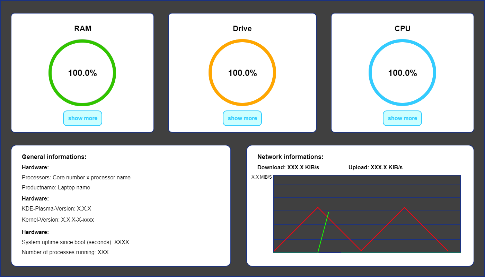

# System-Monitor

## Description
The **System Monitor** is a graphical application for monitoring key system resources such as CPU usage, RAM utilization, disk spakce and netowrk activity.

<p align="center">
  
</p>

## Features
- Display of current CPU usage
- Visualization of RAM usage
- Monitoring of available disk space
- Analysis of network activity
- Graphical interface built with **wxWidgets**

## Technologies
- **C++** with **wxWidgets** for the GUI
- **WX technologies used:**
   - **wxDrawEllipseArc** for circular diagrams
   - **wxScrolledWindow** for scrollable panels
- **sysinfo** for retrieving system data (RAM)
- **statvfs** for retrieving system data (drives)
- **CPU calculation**: Source [stackoverflow](https://stackoverflow.com/questions/23367857/accurate-calculation-of-cpu-usage-given-in-percentage-in-linux/23376195#23376195)
<!-- **SSID find**: Source [iwgetid](https://linux.die.net/man/8/iwgetid)-->
- **To get primary interface**: /proc/net/wireless + regex

## Installation & Usage
1. Install wxWidgets (see [official guide](https://www.wxwidgets.org/))
2. Compile the project:
   ```shell
   mkdir build && cd build
   cmake ..
   make -j8  # use 8 processor cores when compiling
   ```
3. Run tests
   ```shell
   ./system_monitor_tests
   ```

3. Run system_monitor
   ```shell
   ./system_monitor
   ```